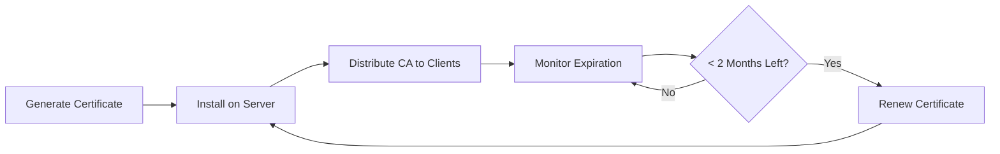

# Certificate Management

This section covers all aspects of SSL/TLS certificate management for your HomeServer, including installation, troubleshooting, and renewal procedures.

## Overview

SSL/TLS certificates are essential for secure HTTPS communication with your HomeServer. This documentation covers:

- **Certificate Installation**: How to install CA certificates on various operating systems
- **Troubleshooting**: Common issues and solutions for certificate problems  
- **Renewal Management**: Understanding and managing the 2-year certificate lifecycle

## Quick Navigation

### 🔄 [Certificate Renewal](renewal.md)
Learn about the 2-year certificate lifecycle and renewal procedures. **Start here** if you need to understand when and how to renew certificates.

**Key Points:**
- Certificates expire every 2 years maximum (browser policy)
- Plan renewals 1-2 months before expiration
- Includes automation strategies and best practices

### 🛠️ [Installation & Troubleshooting](troubleshooting.md)
Comprehensive guide for installing CA certificates on different operating systems and resolving common certificate issues.

**Covers:**
- Step-by-step installation for Linux distributions, BSD systems, and NixOS
- Browser-specific troubleshooting (Chrome, Firefox, etc.)
- Common error resolution

## Certificate Lifecycle

## Best Practices

1. **Set Renewal Reminders**: Calendar alerts 3 months and 1 month before expiration
2. **Document Procedures**: Keep detailed renewal and installation procedures
3. **Test Regularly**: Verify certificate validity and client access monthly
4. **Backup Certificates**: Maintain secure backups of all certificate files
5. **Monitor Expiration**: Use automated tools to track certificate expiration dates

## Emergency Contacts

If you encounter certificate issues that prevent access to your HomeServer:

1. Check the [troubleshooting guide](troubleshooting.md) for common solutions
2. Generate temporary self-signed certificates for emergency access
3. Follow the [renewal procedures](renewal.md) to restore proper certificates

---

**Need Help?** Start with the [troubleshooting guide](troubleshooting.md) for immediate issues, or review the [renewal guide](renewal.md) for lifecycle management. 