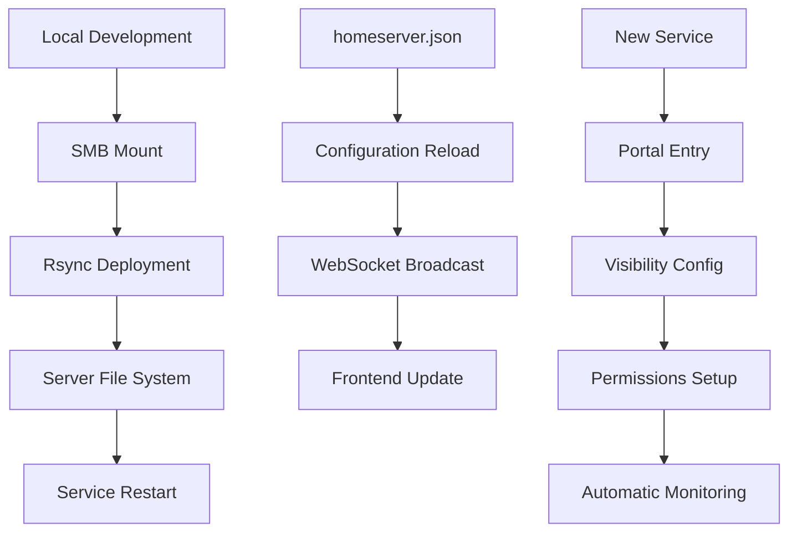

# Developer Documentation

Welcome to the HomeServer developer documentation! This section provides comprehensive guides for developing, configuring, and deploying HomeServer components.

## Overview

The HomeServer platform is designed for extensibility and ease of development. Whether you're adding new services, modifying configurations, or deploying updates, these guides will help you work efficiently with the platform.

## Quick Navigation

### 🔧 [Platform Configuration](homeserver.json.md)
Complete guide to the `homeserver.json` configuration file - the central nervous system of your HomeServer.

**What you'll learn:**
- Current configuration structure and schema
- How to add new services and portals
- Tab configuration and visibility management
- Mount points and permissions setup
- Best practices for configuration management

**Perfect for:**
- Adding new services to the platform
- Understanding the configuration architecture
- Troubleshooting configuration issues
- Planning service integrations

### 🚀 [SMB Development Workflow](smb-development.md)
Learn how to use SMB shares and rsync for efficient development and deployment workflows.

**What you'll learn:**
- Setting up SMB shares for development access
- Mounting server directories locally
- Rsync deployment patterns and best practices
- Automated deployment scripts
- Troubleshooting deployment issues

**Perfect for:**
- Deploying code changes to "tricky places"
- Setting up efficient development workflows
- Automating deployment processes
- Managing configuration file updates

## Development Architecture

## Development Workflow Overview

### 1. Configuration-First Development
The HomeServer follows a configuration-first approach where most functionality is driven by the `homeserver.json` file:

- **Service Integration**: Add services by updating the portals configuration
- **UI Management**: Control tab visibility and element display
- **Permission Management**: Define access controls for NAS resources
- **Monitoring Integration**: Automatic health monitoring for configured services

### 2. SMB-Based Deployment
Leverage SMB shares for efficient development workflows:

- **Direct Access**: Mount server directories locally for immediate access
- **Selective Deployment**: Deploy specific components or configurations
- **Automated Workflows**: Use rsync for reliable, incremental deployments
- **System Integration**: Deploy to privileged system directories safely

### 3. Live Configuration Updates
The platform supports live updates without service interruption:

- **WebSocket Broadcasting**: Configuration changes are broadcast in real-time
- **Frontend Reactivity**: UI updates automatically reflect configuration changes
- **Service Integration**: New services appear immediately after configuration

## Common Development Tasks

### Adding a New Service
1. **Configure Portal Entry**: Add service details to `homeserver.json`
2. **Set Visibility**: Configure which users can see the service
3. **Setup Permissions**: Define NAS access if needed
4. **Deploy Configuration**: Use SMB workflow to deploy changes
5. **Verify Integration**: Test service monitoring and access

### Updating Configurations
1. **Mount SMB Shares**: Access server directories locally
2. **Edit Configurations**: Modify service or system configurations
3. **Deploy Changes**: Use rsync to deploy updates
4. **Restart Services**: Restart affected services via SSH
5. **Verify Functionality**: Test changes and monitor logs

### Troubleshooting Development Issues
1. **Configuration Validation**: Check JSON syntax and required fields
2. **Permission Verification**: Ensure proper file ownership and access
3. **Service Status**: Monitor service health and logs
4. **Network Connectivity**: Verify SMB and SSH access
5. **Deployment Verification**: Confirm files deployed correctly

## Development Environment Setup

### Prerequisites
- **SMB Client**: For mounting server shares
- **SSH Access**: For service management and troubleshooting
- **Rsync**: For efficient file deployment
- **JSON Tools**: For configuration validation

### Recommended Tools
- **Text Editor**: VS Code, Vim, or your preferred editor
- **JSON Validator**: For syntax checking
- **Network Tools**: For connectivity troubleshooting
- **Process Monitoring**: For service status checking

## Best Practices

### 🔒 Security
- Use secure credentials for SMB access
- Implement least-privilege access controls
- Regularly rotate development passwords
- Validate configurations before deployment

### 📝 Documentation
- Document configuration changes
- Maintain deployment procedures
- Track service dependencies
- Update troubleshooting guides

### 🧪 Testing
- Test changes locally first
- Use incremental deployment strategies
- Verify functionality after deployment
- Monitor service health continuously

### 🔄 Version Control
- Track configuration changes in git
- Use meaningful commit messages
- Maintain backup configurations
- Document breaking changes

## Getting Help

### Common Issues
- **Configuration Errors**: See the [Platform Configuration](homeserver.json.md) troubleshooting section
- **Deployment Problems**: Check the [SMB Development Workflow](smb-development.md) troubleshooting guide
- **Service Integration**: Review the service integration checklist
- **Permission Issues**: Verify mount points and access controls

### Resources
- Configuration schema documentation
- Service integration examples
- Deployment script templates
- Troubleshooting checklists

---

**Ready to start developing?** Begin with the [Platform Configuration](homeserver.json.md) guide to understand the system architecture, then move to the [SMB Development Workflow](smb-development.md) to set up your deployment process. 